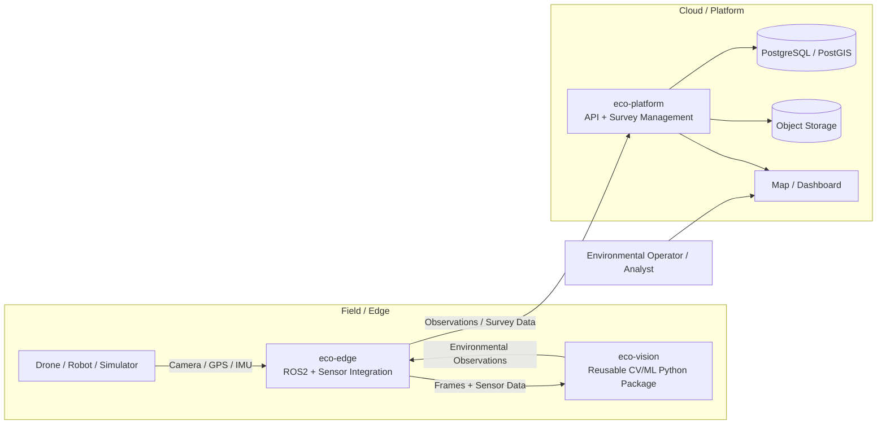

```mermaid
flowchart LR
    User[Environmental Operator / Analyst]

    subgraph Field["Field / Edge"]
        Drone[Drone / Robot / Simulator]
        Edge["eco-edge\nROS2 + Sensor Integration"]
        Vision["eco-vision\nReusable CV/ML Python Package"]
    end

    subgraph Cloud["Cloud / Platform"]
        Platform["eco-platform\nAPI + Survey Management"]
        DB[(PostgreSQL / PostGIS)]
        Storage[(Object Storage)]
        Dashboard[Map / Dashboard]
    end

    User --> Dashboard

    Drone -->|Camera / GPS / IMU| Edge
    Edge -->|Frames + Sensor Data| Vision
    Vision -->|Environmental Observations| Edge
    Edge -->|Observations / Survey Data| Platform

    Platform --> DB
    Platform --> Storage
    Platform --> Dashboard
```
